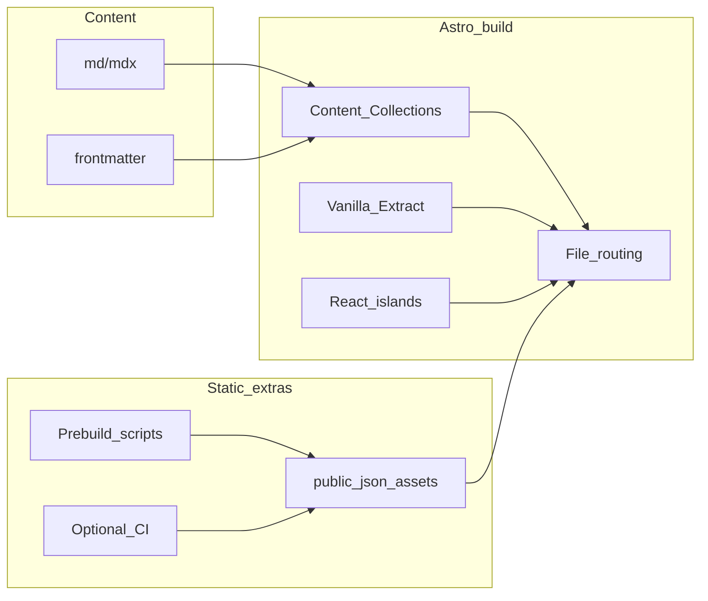

# Hexo Stellar → Astro（Vanilla Extract + React Islands）迁移规划

## 现状与目标

- 当前仓库：[package.json](d:/Workbench/静态网站/blog-with-astro/package.json) 为 Astro 6 + MDX，布局仍是官方示例（如 [src/layouts/BlogPost.astro](d:/Workbench/静态网站/blog-with-astro/src/layouts/BlogPost.astro) 内联 `<style>`）。
- 目标：视觉与信息架构贴近 [xaoxuu/hexo-theme-stellar](https://github.com/xaoxuu/hexo-theme-stellar)（博客 / Wiki / 专栏 / 笔记 / 时间线 / 友链等），样式统一走 **@vanilla-extract/css**，交互与「特殊渲染」用 **React island**（`client:`*）。
- **部署约束（已定）**：**全静态**，构建产物部署到 **nginx**（仅托管 `dist/` 静态文件）。不引入 Astro SSR、混合渲染（hybrid）、服务端适配器或站内 API 路由；凡需「动态感」的能力，一律落在你可控的 **构建期**、**可选 CI**、或 **浏览器端 fetch**（且受 CORS 约束）。

---

## 1. 工具链与项目形态

| 能力              | 建议                                                                                                                                                                                                                                                                                                           |
| --------------- | ------------------------------------------------------------------------------------------------------------------------------------------------------------------------------------------------------------------------------------------------------------------------------------------------------------ |
| Vanilla Extract | 安装 `@vanilla-extract/css` 与 `@vanilla-extract/vite-plugin`，在 [astro.config.mjs](d:/Workbench/静态网站/blog-with-astro/astro.config.mjs) 的 `vite.plugins` 中注册（见 [vanilla-extract Astro 文档](https://vanilla-extract.style/documentation/integrations/astro/)）。全局 reset、字体与主题用 `globalStyle` / `createGlobalTheme`。 |
| React           | `@astrojs/react`；约定 `src/components/islands/**/*.tsx` 仅放需水合的组件，避免默认把整页变成客户端组件。                                                                                                                                                                                                                               |
| 静态输出            | 使用 Astro 默认 `**output: 'static'**`（或可显式写出）。**不安装** `@astrojs/node` 等服务端适配器；`astro build` 生成标准 HTML/JS/CSS，由 nginx `root` 指向构建目录即可。                                                                                                                                                                           |

**nginx 侧**：仅需指向静态根目录、按需配置 `try_files` 回退到 `index.html`（若未来有 SPA 式路由再考虑；常规 Astro 博客多为真实路径 HTML，默认静态规则即可）。

---

## 2. 设计系统：从 Stellar 到 Vanilla Extract

1. **对照源**：以 `hexo-theme-stellar` 的样式变量（常为 SCSS/CSS 变量）为清单，在本项目中建立 `src/styles/theme.css.ts`（或拆分 `tokens`、`variants`）。
2. **推荐结构**：
  - `createGlobalTheme` 或 `createThemeContract`：颜色、圆角、阴影、间距、字号、侧栏宽度、内容最大宽（Stellar 多栏布局依赖这些）。
  - 组件级 `style` / `recipe`（若引入 `@vanilla-extract/recipes`）：卡片、按钮、标签、导航高亮，避免魔法字符串 class。
3. **替换现有内联样式**：把 [BlogPost.astro](d:/Workbench/静态网站/blog-with-astro/src/layouts/BlogPost.astro)、[Header.astro](d:/Workbench/静态网站/blog-with-astro/src/components/Header.astro) 等中的 `<style>` 逐步迁到 `*.css.ts`，保留语义化 HTML，便于与 Stellar 结构对齐。

---

## 3. 内容模型：多集合映射 Stellar 四类体系

在 [src/content.config.ts](d:/Workbench/静态网站/blog-with-astro/src/content.config.ts) 上扩展（示意）：

- `**blog`**：现有集合基础上增加 Stellar 常用字段：`tags`、`categories`、`author`、`cover`、`layout`（文章模板）、`banner` 等（字段以你从 Hexo 源站实际使用的 frontmatter 为准）。
- `**wiki**`：`glob` 指向独立目录，schema 含层级：`wiki_tab`、`order`、`sidebar` 元数据等（与 Stellar wiki 侧栏树对齐）。
- `**columns**`（专栏）：可为独立集合，或 `blog` 中带 `columnId`；专栏索引页按集合查询分组。
- `**notes**`：短内容集合；若需「笔记流」列表页，单独 schema（日期、可见性等）。

**迁移策略**：从 Hexo `source/_posts`、`_wiki` 等目录分批拷贝；用脚本或手工统一 frontmatter 到 Zod schema（先做最小必填集，再迭代）。

---

## 4. 路由与页面骨架（对齐 Stellar 信息架构）

在 `src/pages/` 下按 Stellar 习惯增设（路径可按你原站 URL 微调）：

| 页面                                                    | 数据来源                   |
| ----------------------------------------------------- | ---------------------- |
| 首页                                                    | 精选文章、专栏入口、可选时间线摘要      |
| `/blog`、`/archives`、`/tags/[tag]`、`/categories/[cat]` | `getCollection` + 分页   |
| 文章详情                                                  | 现有 `[...slug]` 模式扩展多集合 |
| Wiki 枢纽与文档页                                           | `wiki` 集合 + 自定义侧栏布局    |
| 专栏列表 / 专栏阅读                                           | `columns` 或按字段筛选       |
| 笔记列表                                                  | `notes`                |
| 友链、关于、搜索页                                             | 全部为构建期生成的静态页           |

**布局组件**：抽一层 `StellarShell`（顶栏、侧栏、侧栏 TOC、footer），由具体页面传入 slot；与现 `Header`/`Footer` 合并演进，避免重复。

---

## 5. Hexo「标签语法」→ MDX 组件（静态为主）

Stellar 大量能力来自 Hexo tag plugins。迁移等价物为：**MDX + 组件映射**。

- 在 MDX 集成中注册短名称组件（如 `<Note>`、`<Tabs>`、`<Timeline>`），语义对应原 tag。
- **默认静态**：构建期渲染，无 JS。
- **需要交互**：该组件改为 React island，外层样式仍用 Vanilla Extract（`className={styles.x}`）。
- **需要「远程」内容**：不在运行时走本站 API；改为构建脚本拉取后写入 `src/content` 或 `public/data/*.json`，再被页面或 island 读取。

优先级建议：**正文排版与常用容器（note/folding/tabs）→ 阅读体验**；**原依赖服务端数据的 tag → 先映射为静态数据路径（YAML/JSON）或构建期生成**。

---

## 6. React Islands 与「伪动态」的静态实现

以下适合 `client:visible` 或 `client:idle`（除非首屏强依赖）：

| 场景             | 做法要点                                                                          |
| -------------- | ----------------------------------------------------------------------------- |
| 目录 TOC + 滚动高亮  | 读 headings（由 Astro 传入 props），Intersection Observer                            |
| 站内搜索           | Pagefind、构建期生成的搜索索引 JSON，或静态 JSON + 客户端迷你索引                                   |
| 主题切换（亮/暗）      | `localStorage` + `document.documentElement` class；VE 用 `vars` 切换 theme（纯静态友好） |
| Tabs、折叠面板、图片灯箱 | 客户端状态                                                                         |
| 数学公式           | `remark-math` / `rehype-katex` 构建期输出，或 island 仅在必要时加载 KaTeX                   |

**原 Stellar「动态数据」在纯静态下的等价策略**（不再使用 SSR/API）：

| 场景                   | 静态策略                                                                                                       |
| -------------------- | ---------------------------------------------------------------------------------------------------------- |
| 远程 Markdown / README | `**astro build` 前** npm 脚本抓取 Markdown/HTML，写入仓库或 `public/`；或在 CI 中跑脚本再部署                                   |
| 友链在线检测               | **不作为运行时能力**：友链列表用 YAML/MD 维护；可选 **CI**（定时）探测可达性，生成 `public/data/friends-status.json` 提交或作为构建产物（注意礼貌抓取与频率） |
| Explorer / 订阅时间线     | 数据源为 **静态 JSON**（手工或脚本生成）；若需聚合第三方 API，仅在 **浏览器端 fetch** 且对方允许 CORS；否则放弃自动聚合或改为链接跳转                         |

---

## 7. 实施顺序（降低返工）

1. **工具链**：Vanilla Extract + React；确认 **仅静态** `astro build`，无 adapter。
2. **主题与全局样式**：tokens + 基础排版（`.prose` 等价），对齐 Stellar 默认观感。
3. **壳层布局**：`StellarShell`、导航、侧栏占位。
4. **博客**：列表、详情、标签/归档；MDX 高频组件第一批。
5. **Wiki / 专栏 / 笔记**：递增集合与路由。
6. **「动态」parity**：按上表用脚本/CI/客户端补齐；绝不引入服务端路由。
7. **SEO/RSS**：延续 `@astrojs/rss`，URL 与原文一致优先。
8. **nginx**：文档化 `root`、`gzip`、`cache-control` 与 HTTPS（可选），确保静态资源 long-term cache。

---

## 8. 风险与取舍（提前知情）

- **全量对齐 Stellar tag 生态**：工作量集中在 MDX 组件与文档迁移脚本；建议维护一份「tag → 组件」对照表。
- **纯静态**：无法在无 CORS 的第三方站点上做「服务端代理拉取」；远程内容必须 **构建期下载入库** 或 **浏览器直连可跨域的 API**。
- **样式**：Stellar 若依赖特定图标字体或第三方 CSS，需逐个改为 VE 或可控依赖，避免全局污染。

---

## 9. 与你仓库的直接衔接点

- 配置入口：[astro.config.mjs](d:/Workbench/静态网站/blog-with-astro/astro.config.mjs)
- 内容 schema：[src/content.config.ts](d:/Workbench/静态网站/blog-with-astro/src/content.config.ts)
- 首个样式迁移候选：[src/layouts/BlogPost.astro](d:/Workbench/静态网站/blog-with-astro/src/layouts/BlogPost.astro)、[src/components/Header.astro](d:/Workbench/静态网站/blog-with-astro/src/components/Header.astro)

已经克隆一份 `hexo-theme-stellar` 在项目根路径，可作逻辑，视觉与变量对照。